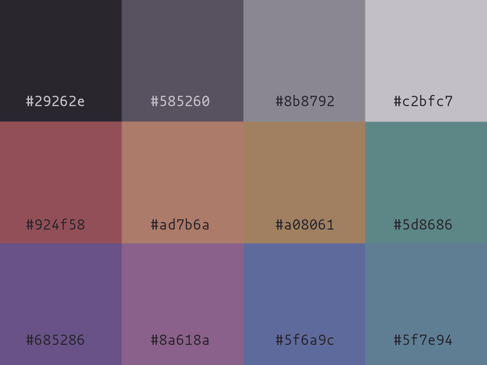

<div align="center">

# Hyprland Dotfiles

My easy and minimal dotfiles for hyprland

<br>
  <a href="#Screenshots"><kbd> <br> Screenshots <br> </kbd></a>&ensp;&ensp;
  <a href="#Apps"><kbd> <br> Apps <br> </kbd></a>&ensp;&ensp;
  <a href="#Theme"><kbd> <br> Theme <br> </kbd></a>&ensp;&ensp;
  <a href="#Installation"><kbd> <br> Installation <br> </kbd></a>&ensp;&ensp;

</div>

---

## Screenshots

<div align="center">

https://github.com/user-attachments/assets/5441a8aa-1b3b-45ae-b679-7fc5474403a5

</div>

## Apps
|Component|Resource| 
|:---------|:-----|
|WM| Hyprland|
|Bar| waybar|
|Launcher| wofi|
| Terminal| kitty|
| Notifications| mako|
| Shell| fish|
| Fetch| fastfetch|
| Theme| smoke (made by me)|

---

## Theme

- **Smoke dark**



- **Smoke light**


- Color file: ```config/hypr/scripts/colors.env-all```
- Vim theme: ```config/nvim/colors/smoke*.vim```

---

## Installation
1. Create backups
```bash
cp -r $HOME/.config $HOME/config-back
```

2. Clone the repository
```bash
git clone https://github.com/vid4l-07/dotfiles-hyprland.git
cd dotfiles
```

3. Copy the dotfiles
```bash
mv config/* wallpapers $HOME/.config
```

## Contributions

<p style="max-width: 500px;">
❗If something does not work,
<a href="https://github.com/vid4l-07/dotfiles-hyprland/issues/new" rel="noopener noreferrer">open an issue</a>
 on this repository or E-Mail me via
<a href="mailto:h.vidal7@proton.me"> h.vidal7@proton.me </a>❗

I am always open to suggestions and feedback
</p>
